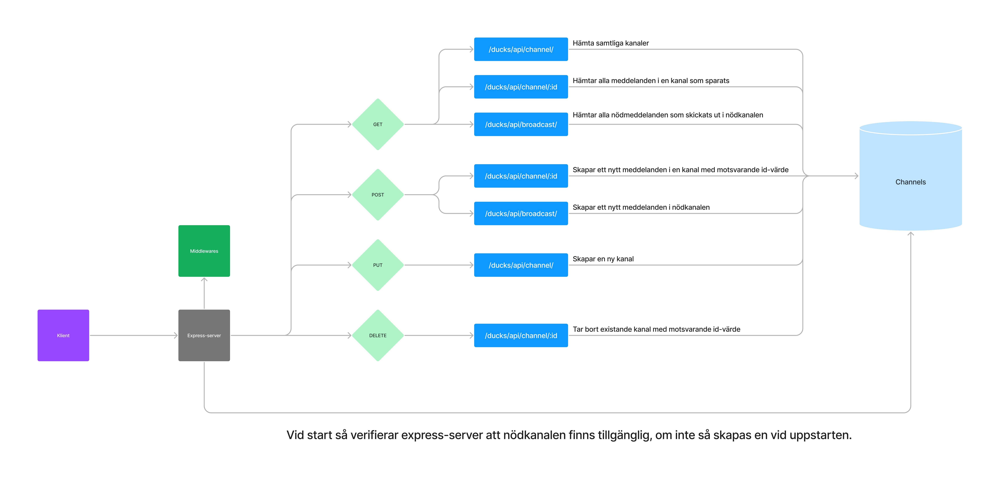

# Vägradio
**Deadline**: 14e april 17:00.

Utgå från de grupper ni skapade i början av kursen, se grupperna på omnius som ni skapade i början av kursen.

Syftet med denna uppgift är att studerande ska få en möjlighet att redovisa förståelse för backend arkitektur genom skapandet av en chatt-apps backend. I uppgiften betonas vikten av en genomtänkt backend där studerande **inte** förväntas spendera mer än ett par timmar på att utveckla en frontend lösning. Vidare så behöver inte heller frontended täcka all backend tjänster då verktyg såsom insomnia, postman och thunderclient bör kunna användas för att "testa" samtliga tjänster.

## Uppdragsbeskrivningen (Frivilig läsning, tekniska krav längre ner)

Dotterbolaget Phone Duck inc. till bolaget Budget Ducklings, som hanterar utveckling av ny mjukvara för personer som har stött på oönskade situationer i traffiken fick nyligen höra om en älgvandring som hade stoppat resenärer förbi Hudiksvall.

Gertrude, resnär fast i traffikstoppet, som är ett stort fan av att chattapplikationer skickade in ett förslag till Phone Duck inc. som gick ut på att utsatta i närtraffiken kunde ansluta till olika chatt kanaler baserat på intresse. Tanken var att det finns en huvudsaklig kanal som skickar ut nödmeddelanden för stopp, och en annan kanal som annonserade ut nya kanaler som användare hade skapat upp för att roa sig i väntan på att trafikken skulle släppa.

### Viktig avgräsning
Detta är en backendkurs och sätter inga krav på en fungerande frontend applikation. I början av kursen så fick ni möjlighet att fundera kring hur den skulle se ut vilket *kan* underlätta i testandet av applikationen. Ifall backenden går att köras enligt kraven enbart med thunderclient, postman eller liknande verktyg så är uppgiften godkänt.

I fallet av högre betyg så förväntas det användas sockets. Dock vill det även här betonas att det inte förväntas finnas en färdig frontend för att illustrera socketslösningarna i ett färdig produkt utan snarare som kortare script-lösningar i javascript som illustrerar datakommunikation mellan socket och server.

## Tekniska krav
Studerande utvecklar en backend tjänst som kan lagra information om chatter och chattkanaler enligt beskrivning nedan. Observera att data förväntas lagras i en databas men att detta *inte* behöver redovisas i videoinspelningen.

#### Terminologi
**Annonserade kanaler** syftar på kanaler som tidigare skickats ut via en PUT förfrågan och finns tillgängliga via channel api:et, se detaljer nedan. Varje annonserad kanal ska ha ett tema som skaparen av kanalen sätter.

**Nödkanal** syftar på en unik (endast en) kanal som skapas vid uppstart och håller i alla nödmeddelanden som skickas.

### Endpoints
Backendend ska innehålla **minst** följande fungerande endpoints. Varje endpoint beskrivs som "[http-metod] - url <-- förväntat resultat vid anrop".

1. [GET] - http://adress:port/ducks/api/channel/ <-- hämtar en lista över annonserade kanaler. Se VG kritierier för krav till ett högre betyg.
   
2. [GET] - http://adress:port/ducks/api/channel/:id <-- hämtar innehållet i en identiferad kanal som tidigare har annonserats ut, detta syftar på meddelanden som har skickats i kanalen. Se VG kritierier för krav till ett högre betyg.
   
3. [PUT] - http://address:port/ducks/api/channel/ <-- skapar en ny kanal. Tema (rubrik) på kanalen ska skickas som en del http-body:n, förslagvis som del av ett json objekt.
   
4. [POST] - http://adress:port/ducks/api/channel/:id <-- skickar ut ett nytt meddelanden till en identiferad kanal som tidigare har annonserats ut. Innehållet i ett meddlande bör vara *minst* anvsändare och innehåll. 
   
5. [DELETE] - http://adress:port/ducks/api/channel/:id <-- tar bort en identiferad kanal som tidigare annonserats ut. Se VG kritierna för krav till ett högre betyg.

6. [GET] - http://adress:port/ducks/api/broadcast/ <-- hämtar en lista över alla händelser som har skickats ut, ex. älgvandring, traffikolycker m.m. Se VG kritierier för krav till ett högre betyg.
   
7. [POST] - http://adress:port/ducks/api/broadcast/ <-- skapar en ny nödhändelse.

  
Klicka för att se ovanstående endpoints i figma graf

  
  

## Bedömning

Innan deadline ska en individuell videopresentation skickas in via omnius. Videon måste uppfylla följande tekniska krav:
1. Studerande måste vara synlig i minst 15 sekunder under videoinspelningen.
2. Videon får **inte** överstiga 3 minuter och 30 sekunder (290 sekunder totalt).
3. Ljudkvaliteten ska vara accepterbar och det ska gå att höra den inspelades röst under hela inspelningen.
   
Följande ska presenteras under inspelningen.
### Introduktion (under 1 minut)
- Namn på individ
- Kort redovisning för hur projektet fördelades under arbetet.
  
### API - Redovisning av två endpoints (under 2 minuter)
Obs. för högre betyg måste en endpoint involvera socket kommunikation **och** den andra som en del av JWT auth.

- Beskriv två endpoints som användare olika http metoder
  - Betoning på vilket problem de löser. Ex "Denna tillåter användaren att .."
  
- För respektive endpoint, visa och förklara flödet i koden. 
  - Betoning på hur problemet löses. Se "Förklara kod som en user story" nedanför för förslag på ett godkänt upplägg

#### Förklara kod som en user story 

När du förklarar flödet i koden så ska detta göras utifrån problemet som den löser. Detta bör göras liknande till en user story.

*Case*: Yves mobil anropar http://.../api/cart/ med PUT metoden för att lägga till en ny vara i varukorgen.
1. Först så kollar vi i api:et så att användaren har ett giltigt JWT access token i authorization headern.
2. "Om access token inte är giltigt så avbryts anropet och felkoden 400 skickas tillbaka för att meddela att JWT token:et saknades"
3. "Om jwt:en är giltig så fortsätter vi till huvudroutern i api:et".

4. "I koden så plockar vi ut varans namn och kvantiteten för att sedan placera informationen i databasen. Denna information skickades via ett json objekt i HTTP-body:n."
5. "Om databasen inte är tillgänglig så skickas det tillbaka statuskod 503 så att Yves mobil kan meddela att tjänsten är nere."
6. "Om datan kan sparas så skickas istället statuskod 201 tillbaka för att meddela att datan har lagts till i databasen."

## Inlämning
Via omnius skicka in följande
- Videoinspelning
- Länk till github repo med fullständig källkod

## Betygskriterier
För ett högre betyg krävs det att sockets används för att skapa realtidsdialoger mellan klient och backend.

### Godkänt
För betyget godkänt så ska samtliga endpoints implemeteras enligt beskrivningen ovan samt redovisande av en inspelad video där deltagar visar förmåga på att förklarar innehåll och deltagande i arbetet. Koden ska även, till viss del, ta hänsyn till att klienten *kan* skicka fel format på datan. Exempelvis så bör fallet då ett id-värde saknas resultera i en lämplig 400 kod.

### Väl godkänt
För betyget väl godkänt så ska kraven för godkänt vara uppfyllda. Vidare krävs det även att JWT används för att verifiera att användaren har behörighet till att göra särskilda anrop, hur behörigheten skapas bestäms av studerande.

#### VG-socket användning
Anrop till endpoints 3 och 4 resultera i att sockets skickar ut uppdateringarna istället för att klient aktivt hämtar informationen. Detta innebär att endpoints:en 1, 2 samt 6 ersätts av socket anslutning(ar) med likvärdigt syfte till deras tidigare REST endpoints syfte.

#### VG-jwt användning
Samtliga anrop ska kräva att användaren har ett giltigt jwt token. Endast anrop till endpoint 1 och 6 kan utföras utan ett giltigt jwt token. Endast användare med särskild behörighet (e.g. admin roll) ska kunna utföra en POST till endpoint 7.

## Återkoppling

Sker via ominus senast 3 veckor efter avslutad kurs i samband med kursbetyget.

--- 
<small>Varför inte börja med en kopp kaffe? </small> :coffee:
